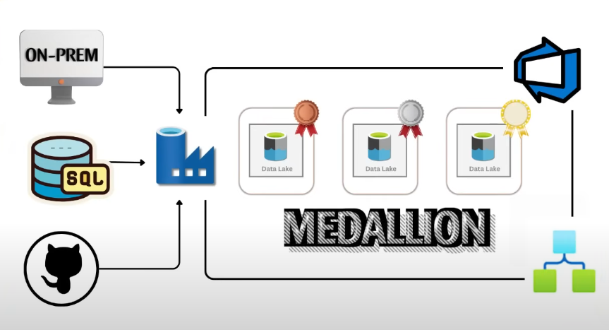

# Data-factory-with-Devops

This project demonstrates a solution in Azure Fabric with 3 pipelines that takes 3 different data sources and extracts the data to an azure Data Lake container classified as a bronze layer. A dataflow applies transformations to the data and then write the new data to the silver layer in format of Delta tables.
Another dataflow applies data transformation to the delta tables stored in the silver layer and then served as new tables in the gold layer in the data lake.

## 📖 Project Overview
This project involves:

1. **Api_ingestion**: extracting a Json file from GitHub.
2. **On premises ingestion**: Extracting csv files from a computer)
3. **SQL ingestion**: database ingestion with incrementing loading, it takes a table and migrates the table based on a date parameter, the data is write in parquet format.
4. **Logic App**: a logic app that checks if the SQL ingestion was done perfectly, otherwise, it triggers an email specifying the error and pipeline details
5. **Data flow**: the data flow helps to create derived columns, filters and apply basic transformations in the data.

#### Specifications
- **Data Sources**: Azure SQL table, three CSV hosted on a local computer, a GitHub parquet file.
- **Data Quality**: the files are ready to consume, just basic transformations, like new columns, capitalized letters or filters are applied
- **Integration**: The solution comprehends a Medallion architecture defined as bronze, silver and gold layers
- **Scope**: Show a completed solution of ETL using Microsoft data Factory
- **Documentation**: Provide clear documentation of the data model to support both business stakeholders and analytics teams.
